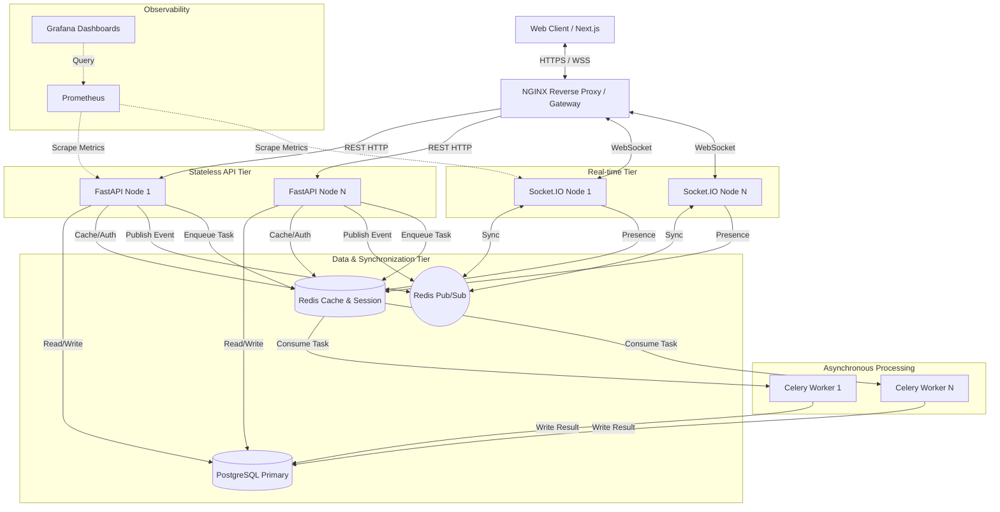

# Distributed Chat System

An enterprise-grade, highly available real-time communication platform designed for internal corporate use. This system provides a robust foundation for secure, scalable, and auditable team collaboration.

## Architecture Overview

The platform is built on a distributed microservices architecture, separating stateless HTTP APIs from stateful WebSocket connections. It leverages Redis for high-throughput cross-instance message synchronization and PostgreSQL for persistent, transactional storage.



## Key Enterprise Capabilities

* **High Availability & Horizontal Scalability**: Stateless API tier (FastAPI) and independent WebSocket nodes (Node.js) scale horizontally. Cross-node real-time synchronization is handled by Redis Pub/Sub.
* **Security & Access Control**: Secure JWT-based authentication with refresh token rotation. Password hashing via bcrypt. Role-based access control (RBAC) across rooms.
* **Auditability & Compliance**: Immutable audit logging for critical actions. Structured JSON logging via `structlog` for integration with centralized logging systems (ELK/Datadog/Splunk).
* **Observability**: Built-in Prometheus metrics exposition across all tiers. Pre-provisioned Grafana dashboards for monitoring system health, connection counts, and message latency.
* **Performance**: Asynchronous non-blocking I/O across the stack (asyncpg, FastAPI, Node.js). Redis caching for high-read access patterns (sessions, presence).
* **Background Processing**: Celery distributed task queue for non-critical path operations (e.g., push notifications, batch archiving, offline event syncing).

## Technical Stack

* **Frontend**: Next.js (App Router), React, Zustand (State Management), Tailwind CSS, Socket.IO Client.
* **API Gateway / Proxy**: NGINX.
* **Core API**: Python 3.11, FastAPI, SQLAlchemy 2.0 (Async), Pydantic v2.
* **Real-time Engine**: Node.js, Socket.IO, Redis Adapter.
* **Database**: PostgreSQL 15 (Asyncpg).
* **Cache & Message Broker**: Redis 7.
* **Background Workers**: Celery.
* **Observability**: Prometheus, Grafana.

## Getting Started

### Prerequisites
* Docker and Docker Compose (v2)
* Node.js 20+ (for local frontend development)
* Python 3.11+ (for local backend development)

### Local Development Environment

1. **Environment Configuration**:
   ```bash
   cp .env.example .env
   # Ensure SECRET_KEY and credentials meet security policies.
   ```

2. **Start Infrastructure**:
   ```bash
   docker-compose up -d
   ```
   This provisions the Database, Redis, API, WebSocket Server, Workers, and Monitoring suite.

3. **Database Migrations**:
   ```bash
   docker-compose exec backend alembic upgrade head
   ```

### Access Points
* **Web Application**: `http://localhost` (via NGINX)
* **API Documentation (Swagger UI)**: `http://localhost/docs`
* **Grafana Dashboards**: `http://localhost:3001` (admin/admin)
* **Prometheus Targets**: `http://localhost:9090`

## Deployment & CI/CD

This repository is structured for containerized deployment via Kubernetes or AWS ECS. 
* Production Docker Compose overrides (`docker-compose.prod.yml`) are provided for standalone VM deployments.
* CI/CD pipelines should build images from the respective `Dockerfile`s in `backend/`, `websocket-server/`, and `frontend/`.

## Contributing Policies

* All commits must be signed and trace back to an authorized issue tracker ticket.
* Migrations must be backward-compatible (no dropping columns in use).
* Test coverage threshold is strictly enforced at 85%.